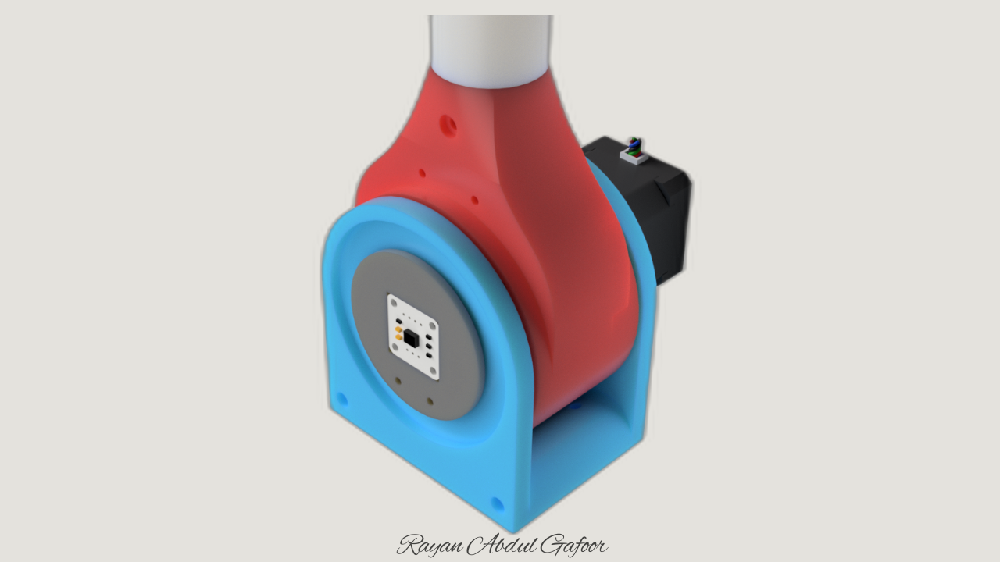

# Precision Robotic Joint Actuator

Low-backlash reverse-cycloidal robotic actuator for articulated robotic manipulation systems.



[Watch the Presentation Video](https://www.youtube.com/watch?v=Ntv47qB1Hks&embeds_referring_euri=https%3A%2F%2Fwww.rayanabdulgafoor.in%2F)

---
## Full Project Documentation

Detailed project documentation, development logs, fabrication workflow, and testing results are available here:

[Portfolio Documentation](https://www.rayanabdulgafoor.in/projects/robotics/gear-box/cycloidal-drive-21/index.html)

---

## Overview

This project focuses on the development of a compact reverse-cycloidal robotic joint actuator designed for articulated robotic manipulation systems. The actuator was engineered to achieve high torque multiplication, low backlash, compact coaxial integration, and repeatable motion control using embedded feedback systems.

The project combines mechanical transmission design, embedded systems integration, rapid prototyping, and iterative hardware validation. The actuator architecture was experimentally evaluated through fabrication, assembly, calibration, and closed-loop testing workflows.

---

## Key Features

* 21:1 reverse-cycloidal reduction systems
* Compact coaxial robotic joint architecture
* Low-backlash transmission design
* Closed-loop encoder feedback integration
* ESP32-based embedded control system
* Modular actuator housing and assembly
* Rapid prototyping using 3D printing workflows
* Iterative mechanical testing and validation

---

## Tech Stack / Hardware

ESP32 | AS5600 Encoder | NEMA17 Stepper Motor | TB6600 Driver | Fusion 360 | PETG | Arduino IDE

---

## Mechanical Design Highlights

* Optimized lobe geometry and eccentricity for smoother torque transmission
* Bearing-supported output architecture for improved alignment stability
* Modular assembly for easier calibration and maintenance
* Compact actuator packaging for robotic arm integration

---

## Embedded & Control System

* ESP32-based actuator control architecture
* AS5600 magnetic encoder integration over I²C
* Closed-loop position feedback implementation
* Serial-command based actuator control workflow
* Stepper motor control using TB6600 drivers

---

## Fabrication & Prototyping

The actuator system was fabricated using a combination of:

* PETG FDM 3D printing
* Laser-cut support components
* Rapid iterative prototyping workflows
* Experimental assembly and calibration procedures

---

## Testing & Validation

The actuator was iteratively tested to evaluate:

* Backlash behavior
* Torque transmission smoothness
* Repeatability
* Shaft alignment stability
* Encoder feedback consistency
* Electromechanical integration reliability

<!-- ---

## Repository Structure

```text
precision-cycloidal-robotic-joint-actuator/
│
├── README.md
├── docs/
├── cad/
├── electronics/
├── firmware/
├── media/
├── manufacturing/
└── testing/
```

--- -->


